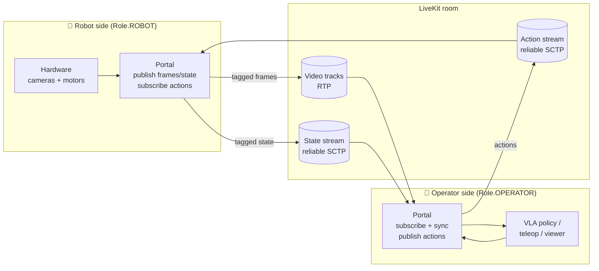
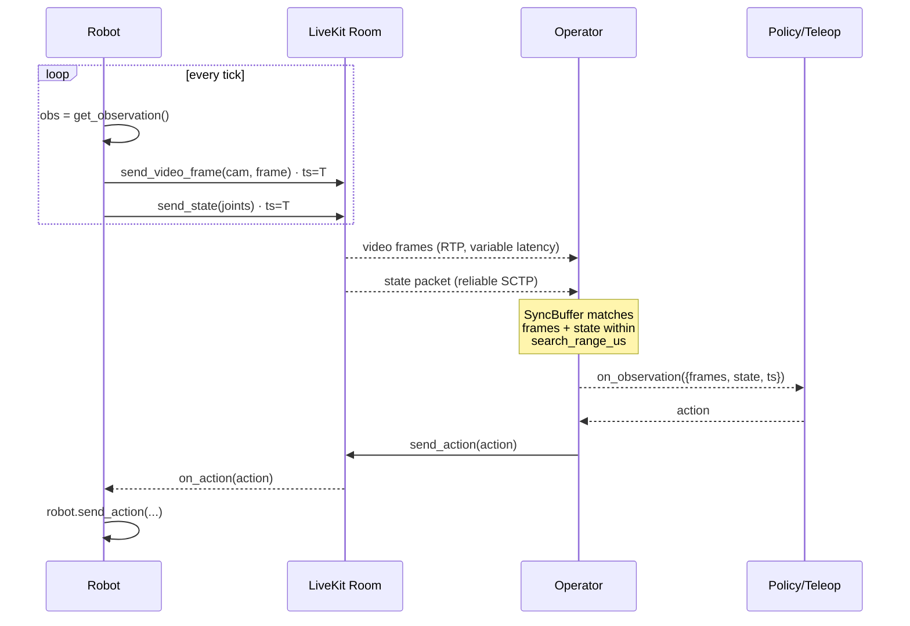
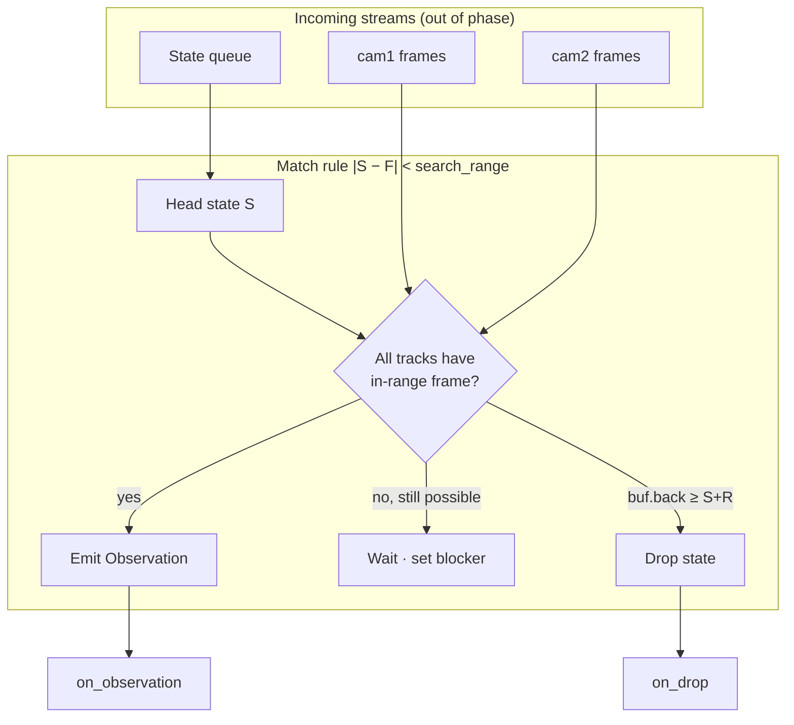

<a href="https://livekit.io/">
  
</a>

# livekit-portal

[](LICENSE)
[](https://www.python.org/downloads/)
[](https://www.rust-lang.org/)

<!--BEGIN_DESCRIPTION-->
A drop-in link between robots and their teleoperators or agents. Portal handles video streams, data streams, and **timestamp-synced observations** over LiveKit, so a VLA model on the operator side sees the same bundled `(frames, state, t)` tuple it would see from a local robot. Works with [LeRobot](https://github.com/huggingface/lerobot) out of the box.
<!--END_DESCRIPTION-->

**Features:**

- **Synchronized observations**: video + state are tagged with sender-side timestamps and re-matched on the receiver into `(frames, state, t)` tuples — the shape VLA policies expect.
- **Low-latency transport**: RGB frames via WebRTC (SIMD RGB→I420 in libyuv), state/action via LiveKit data channels with per-side reliability controls.
- **Clock-aware sync engine**: two-pointer cursor matching, blocker-gated sync, O(1) drop detection. Amortized O(N+M), bounded memory.
- **LeRobot drop-in**: plugins wrap any local `Robot` or `Teleoperator` — the remote arm appears as a local lerobot device.
- **Polyglot**: Rust core, Python via [UniFFI](https://mozilla.github.io/uniffi-rs/latest/). NumPy frames on ingress and egress.

**Quick Links:**

- [Why livekit-portal](#why-livekit-portal)
- [Quick Start](#quick-start)
- [How It Works](#how-it-works)
- [Synchronization](#synchronization)
- [Video Frame Format](#video-frame-format)
- [Tuning](#tuning)
- [LeRobot Integration](docs/lerobot.md)
- [Examples](#examples)
- [Architecture Deep Dive](docs/synchronization.md)

## Why livekit-portal

Modern robotics stacks expect **synchronized observations bundled together**. A VLA policy needs video frames and joint states matched by timestamp, delivered as one unit. LiveKit tracks are decoupled by default — video, audio, and data all stream independently with their own pacing, codec paths, and retransmission behavior.

Portal bridges this gap. It tags video frames and state data with sender-side timestamps, then matches them on the receiver side into synchronized observations. The physical robot stays in the loop; Portal only adds the network tier.



## Quick Start

### Install (Python)

```bash
uv pip install livekit-portal
# or
pip install livekit-portal
```

For local development, build the native library once:

```bash
cd python/packages/livekit-portal
uv sync
bash scripts/build_native.sh release
```

### Robot side

```python
import asyncio
from livekit.portal import Portal, PortalConfig, Role

async def main():
    cfg = PortalConfig("session", Role.ROBOT)
    cfg.add_video("camera1")
    cfg.add_video("camera2")
    cfg.add_state(["joint1", "joint2", "joint3"])
    cfg.add_action(["joint1", "joint2", "joint3"])

    portal = Portal(cfg)

    def on_action(action):
        # action.values is the dict; action.timestamp_us is the sender's clock.
        robot.send_action(action.values)

    portal.on_action(on_action)
    await portal.connect(url, token)

    while running:
        obs = robot.get_observation()
        portal.send_video_frame("camera1", obs.image.cam1, width, height)
        portal.send_video_frame("camera2", obs.image.cam2, width, height)
        portal.send_state(obs.state)
        await asyncio.sleep(1 / fps)

asyncio.run(main())
```

### Operator side

```python
import asyncio
from livekit.portal import Portal, PortalConfig, Role

async def main():
    cfg = PortalConfig("session", Role.OPERATOR)
    cfg.add_video("camera1")
    cfg.add_video("camera2")
    cfg.add_state(["joint1", "joint2", "joint3"])
    cfg.add_action(["joint1", "joint2", "joint3"])

    portal = Portal(cfg)

    def on_observation(obs):
        # obs.frames: dict[str, np.ndarray]   # one per registered video track
        # obs.state:  dict[str, float]
        # obs.timestamp_us: int               # sender clock
        action = model.select_action(obs)
        portal.send_action(action)

    portal.on_observation(on_observation)
    await portal.connect(url, token)

asyncio.run(main())
```

Callbacks fire on the asyncio loop that was running when you registered them — user code never runs on the tokio worker thread.

## How It Works

Portal has two roles: **Robot** and **Operator**.

| Role | Publishes | Subscribes |
|------|-----------|------------|
| `Role.ROBOT` | video frames, state | actions |
| `Role.OPERATOR` | actions | video frames + state → **synced observations** |

Each side registers the same schema (`add_video`, `add_state`, `add_action`) in its `PortalConfig`. The role is fixed at construction; calling the wrong send method returns `WrongRole`.



## Synchronization

State and video frames are tagged with the sender's clock. The receiver matches them locally within a configurable search window. An observation is only formed when **every** registered video track has a matching frame for a given state. Unmatched states are dropped and reported via `on_drop`.

Video frame timestamps ride on LiveKit's **packet trailer**, which survives the full WebRTC encode/decode pipeline.



> **Sender requirement:** every received video frame must carry `user_timestamp` in its packet-trailer metadata. Portal enables this automatically on tracks it publishes (`PacketTrailerFeatures.user_timestamp = true`). A subscribed track produced by anything that does *not* set this field is unsupported — either republish the source through Portal or enable user-timestamp trailers on the upstream publisher.

For the full algorithm — two-pointer cursors, blocker-gated sync, O(1) drop detection, eager cross-track drop — see **[docs/synchronization.md](docs/synchronization.md)**.

## Video Frame Format

`send_video_frame` expects packed **RGB24**: byte order `R, G, B`, one byte per channel, no alpha. Layout is row-major and tightly packed (stride = `width * 3`), so an exact buffer is `width * height * 3` bytes. `width` and `height` must both be **even** (I420 chroma subsampling).

This matches NumPy `uint8` arrays of shape `(H, W, 3)` in RGB order — the output of `PIL.Image.convert("RGB")`, or OpenCV's `cvtColor(frame, COLOR_BGR2RGB)`.

Portal converts to I420 internally via libyuv's SIMD-optimized `RAWToI420` before handing the frame to WebRTC. Approximate cost on modern ARM64 (NEON) or x86 (AVX2):

| Resolution | Per-frame | At 30 fps |
|---|---|---|
| 640×480 | ~0.3–0.9 ms | ~1–3% of a core |
| 1280×720 | ~1–3 ms | ~3–10% |
| 1920×1080 | ~2–6 ms | ~6–20% |

If your camera already produces I420/NV12, you're paying for a round-trip. For RGB/BGR sources (most cameras + most Python pipelines), this is as fast as doing the conversion yourself.

## Tuning

Portal assumes **unified sampling** — the robot captures state + frames at the same tick. All sync parameters derive from a single `fps`, and all internal buffers share a single `slack` size.

```python
config.set_fps(30)            # unified capture rate (default: 30)
config.set_slack(5)           # ticks of pipeline headroom (default: 5)
config.set_tolerance(1.5)     # match window in tick units (default: 1.5)

config.set_state_reliable(True)   # default: True
config.set_action_reliable(True)  # default: True

config.set_ping_ms(1000)      # RTT ping cadence; 0 disables (default: 1000)
```

| Parameter | What it controls | When to change |
|---|---|---|
| `fps` | Unified sampling rate. Drives the match window. | Use the **video** rate if video and state differ. Raise to 60 for high-rate robots. |
| `slack` | Ticks of pipeline headroom for every internal buffer. Larger = more jitter tolerance at the cost of staleness. | Default 5 ≈ 167 ms @ 30 fps. Bump under asymmetric rates (see below). Minimum useful value is 2. |
| `tolerance` | How far a state reaches when matching a frame, in tick units. `search_range = tolerance / fps`. | See picker below. |

### Choosing `tolerance`

| Use case | Pick | Why |
|---|---|---|
| Real-time inference / control | `0.5` | A misaligned observation is silently wrong; a drop is an explicit signal. |
| Data collection for VLA training | `1.5` | A ±1-tick misalignment (~16 ms @ 60 fps) is invisible to a trained model; a dropped observation is lost data. |
| Teleop viewer | `1.5` | Visual continuity > frame-perfect alignment. |
| Clean local network (<1% loss) | either | Drops are already rare. |
| Lossy / cellular / wireless | `1.5` | Widening materially reduces drop rate under real loss. |
| Strict-alignment datasets | `0.5` | If downstream tooling relies on exact pairing, drops are cheaper than mislabeled pairs. |

### Asymmetric rates (video faster than state)

1. **Set `fps` to the video rate**, not the state rate. The match window is measured in frame intervals.
2. **Set `slack ≥ ceil(video_rate / state_rate) + 1`**. Default `slack=5` cleanly handles up to ~4× asymmetry.

```python
# Example: 60 fps video, 10 Hz state
config.set_fps(60)
config.set_slack(8)          # ceil(60/10) + 2
config.set_tolerance(1.5)    # still measured in video-tick intervals (~16.6 ms)
```

Under asymmetric rates, the overall drop rate is proportional to `state_rate × video_loss_rate`, not the video rate.

### Reliability

State and action use **reliable (lossless, ordered)** SCTP delivery by default. For high-frequency control where only the latest value matters, switch to unreliable (`set_state_reliable(False)`) to avoid head-of-line blocking under packet loss. Video is always unreliable (RTP).

## Language Support

Portal is written in Rust. Python bindings ship via the `livekit-portal-ffi` crate (UniFFI + C ABI) and a pure-Python package in `python/packages/livekit-portal/`.

### Rust

```toml
[dependencies]
livekit-portal = { path = "livekit-portal" }
```

### Python

```bash
uv pip install livekit-portal
```

Build from source:

```bash
cd python/packages/livekit-portal
uv sync
bash scripts/build_native.sh release
```

`scripts/build_native.sh debug` is faster to iterate on. If the cdylib lives elsewhere (e.g. during Rust-side dev), point `LIVEKIT_PORTAL_FFI_LIB` at it and skip the copy step.

## LeRobot Integration

Two plugin packages expose Portal to [lerobot](https://github.com/huggingface/lerobot). Each plugin wraps around whatever local `Robot` or `Teleoperator` class you already use — the remote arm appears as a local lerobot device to any workflow (teleoperation, dataset recording, policy eval).

| Package | Side | What it wraps |
|---|---|---|
| [`lerobot-teleoperator-livekit`](python/packages/lerobot-teleoperator-livekit) | Robot | Your local `Robot` (e.g. SO-100 over USB) |
| [`lerobot-robot-livekit`](python/packages/lerobot-robot-livekit) | Operator | Your local `Teleoperator` (leader arm, gamepad, policy output) |

Both plugins do Portal sync for you: timestamp-matched observations, reliable state/action channels, RTT/jitter metrics. Full setup: **[docs/lerobot.md](docs/lerobot.md)**.

## Examples

### `examples/python/basic/`

End-to-end smoke test against a LiveKit server. Mints its own JWTs from `LIVEKIT_API_KEY` / `LIVEKIT_API_SECRET`.

```bash
cd examples/python/basic
cp .env.example .env       # fill in LIVEKIT_URL, LIVEKIT_API_KEY, LIVEKIT_API_SECRET
uv sync                    # once
uv run robot.py            # terminal 1
uv run teleoperator.py     # terminal 2
```

### `examples/python/so101/`

Hardware teleop: physical **SO-101 follower arm** driven from a remote **SO-101 leader arm**, with synced camera + joint state rendered in [rerun](https://rerun.io). See [its README](examples/python/so101/README.md) for the full hardware + calibration walkthrough.

## Further Reading

- **[Architecture: Synchronization](docs/synchronization.md)** — the match algorithm, two-pointer cursors, blocker-gated sync, O(1) drop detection, tuning math.
- **[LeRobot Integration](docs/lerobot.md)** — plugin install, schema inference, CLI mode, troubleshooting.
- **[SO-101 Example](examples/python/so101/README.md)** — wire up a real teleop rig end-to-end.

## License

Apache-2.0. See [LICENSE](LICENSE) for details.
